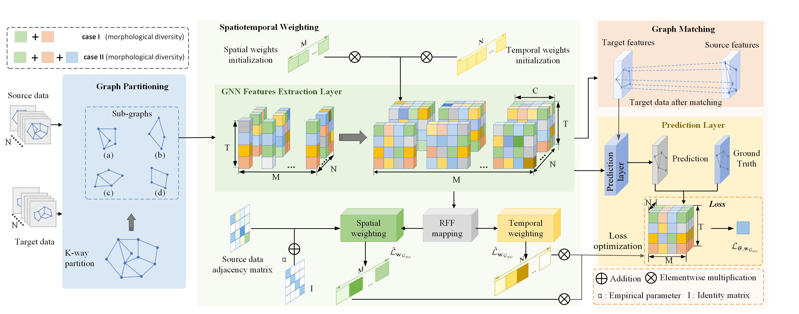

# Spatiotemporal Generalization Graph Neural Network-based Prediction Models by Considering Morphological Diversity in Traffic Networks

> This projec aims at sovling OOD situations in zero-shot cross-region traffic prediction.
>
> 
> The original PEMS03, PEMS04, PEMS07 and PEMS08 data can be downloaded from [GitHub](https://github.com/guoshnBJTU/ASTGNN/tree/main/data).

> The whole traffic data can be partitioned into different goups, and the partitioned traffic data will be preprocessed into normalized data by Z-score normalization.
>
> # STG-GNN: Spatiotemporal Generalization Graph Neural Network

[](https://ieeexplore.ieee.org/abstract/document/10967037)
[](https://www.python.org/)
[](https://opensource.org/licenses/MIT)

> Official implementation of the paper: **"Spatiotemporal Generalization Graph Neural Network-Based Prediction Models by Considering Morphological Diversity in Traffic Networks"** (IEEE Transactions on Intelligent Transportation Systems, 2025).

## 📌 Overview

This project provides an end-to-end causality-based spatiotemporal Out-of-Distribution (OOD) generalization method adaptable to most GNNs for diverse, large-scale, dynamic traffic systems. 

It aims at solving OOD situations in **zero-shot cross-region traffic prediction**. By explicitly considering the morphological diversity (variations in traffic network topologies) in traffic networks, our model achieves robust generalization capabilities, enabling accurate predictions even in entirely unseen regions.

### ✨ Key Contributions
* **Spatiotemporal Weighting:** A causality-based module designed to reduce redundant and spurious feature correlations stemming from graph topology and traffic patterns.
* **Graph Matching & Equal-Sized Partitioning:** Mitigates the spatial shift between source and target networks, and aligns the scale of the networks.
* **State-of-the-art Performance:** Achieves a maximum reduction in MAE of **33.08%** across morphological diversity situations and decreases MAE by up to **40.58%** compared to other OOD-driven baselines.

## 🧠 Model Architecture

<p align="center">
  
</p>
<p align="center">
  <em>Fig. 1: The overview of causality-based spatiotemporal OOD generalization method.</em>
</p>


## 🚀 Getting Started

### 1. Prerequisites
Ensure your environment is set up with the required dependencies:
```
pip install -r requirements.txt
```


## Data preprocessing

```
python prepareData.py
```


## Prerequisites
```
pip install -r requirements.txt
```

### Training

```
python train ASTGNN.py
```

### Testing
```
python predict_ASTGNN.py
```

## The citation of paper
>@article{liu2025spatiotemporal,
  title={Spatiotemporal Generalization Graph Neural Network-Based Prediction Models by Considering Morphological Diversity in Traffic Networks},
  author={Liu, Limei and Duan, Peibo and Chen, Zhuo and Zhang, Jinghui and Feng, Siyuan and Yue, Wenwei and Wang, Yibo and Rong, Jia},
  journal={IEEE Transactions on Intelligent Transportation Systems},
  year={2025},
  publisher={IEEE}
}
